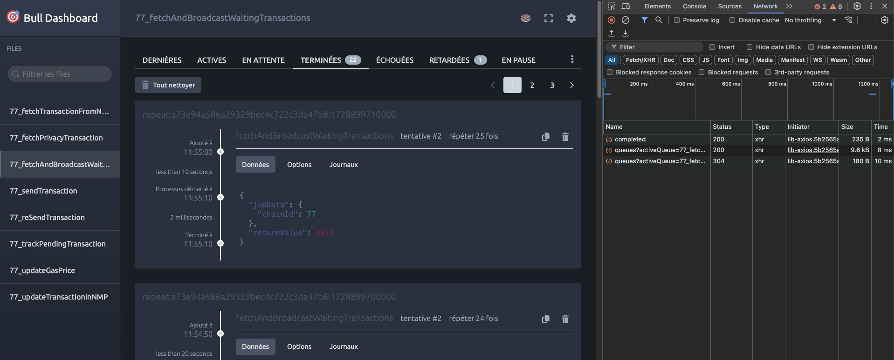

# What is it?

A small repo to reproduce an issue : https://github.com/felixmosh/bull-board/issues/807

# Getting started

``npm i``
``npm run build:watch``
``docker compose up``

Go to http://localhost:3232/admin/queues/77/queue/77_fetchAndBroadcastWaitingTransactions
Try to "Clean all" , nothing happens 

"http://localhost:3232/admin/queues/77/api/queues/77_fetchAndBroadcastWaitingTransactions/clean/completed" is called with a 200 OK Status but queues are not cleaned

# Queues architecture

Queues are in 'jobs':

- fetchWaitingTranasction

